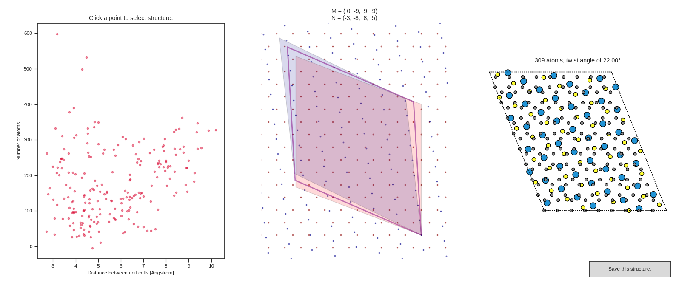

# Building Interfaces

## Coincidence lattices

Coincidence lattices are determined with the algorithm outlined by Schwalbe-Koda ([1]).

[1]: https://doi.org/10.1021/acs.jpcc.6b01496 ". Phys. Chem. C 2016, 120, 20, 10895-10908"

Two 2D lattice bases (lattice vectors are given as column vectors) are given by:

```math
\mathbf{A} = \begin{pmatrix} a_{11} & a_{21} \\ a_{12} & a_{22} \end{pmatrix} ~~~~
\mathbf{B} = \begin{pmatrix} b_{11} & b_{21} \\ b_{12} & b_{22} \end{pmatrix}
```

Such that each point in the 2D plane is given by the coefficients:

```math
P(m_1, m_2) = m_1 \vec{a}_1 + m_2 \vec{a}_2 \\
P(n_1, n_2) = n_1 \vec{b}_1 + n_2 \vec{b}_2
```

Additionally, the two bases can be rotated with respect to each other:

```math
\mathbf{R}(\theta) = \begin{pmatrix} \cos(\theta) & -\sin(\theta) \\ \sin(\theta) & \cos(\theta) \end{pmatrix}
```

Two lattice points of the two bases coincide under the following condition:

```math
\begin{pmatrix} \vec{a}_1 & \vec{a}_2 \end{pmatrix} \begin{pmatrix} m_1 \\ m_2 \end{pmatrix}
= \mathbf{R}(\theta) \begin{pmatrix} \vec{b}_1 & \vec{b}_2 \end{pmatrix}
\begin{pmatrix} n_1 \\ n_2 \end{pmatrix} \\
```
```math
\mathbf{A} \vec{m} = \mathbf{R}(\theta) \mathbf{B} \vec{n}
```

As a tolerance criterion, coincidence is accepted if the distance between the coinciding lattice points is smaller than a threshold (e.g., 0.20 Angström):

```math
| \mathbf{A} \vec{m} - \mathbf{R}(\theta) \mathbf{B} \vec{n} | \leq crit
```

Solving this system of linear equations yields a set of associated vectors for each angle:

```math
S(\theta) = \{ (\vec{m_1}, \vec{n_1}), (\vec{m_2}, \vec{n_2}), ..., (\vec{m_s}, \vec{n_s}), ..., (\vec{m_k}, \vec{n_k}) \} \\
```

From any pair of these associated vectors that is linearly independent, one can construct supercell matrices from the row vectors:

```math
\mathbf{M} = \begin{pmatrix} m_{s1} & m_{s2} \\ m_{k1} & m_{k2} \end{pmatrix}~~~~
\mathbf{N} = \begin{pmatrix} n_{s1} & n_{s2} \\ n_{k1} & n_{k2} \end{pmatrix}
```

This represents a very large set of possible supercell matrices. For practical purposes, this one is reduced by the following conditions:

```math
\angle \left(\vec{m}_s, \vec{m}_k \right) \approx 90^\circ~~~~~~
|\vec{m}_s \times \vec{m}_k| \rightarrow \text{min}
```

So the supercell matrices are chosen such that they minimize the area and yield nice angles.
Then, the coincidence unit cell for both lattices is given by:

```math
\mathbf{MA} \approx \mathbf{N} \mathbf{R}(\theta) \mathbf{B}
```

The new unit cell of the resuling heterostructure can be chosen as a linear combination of the two:

```math
\mathbf{C} = \mathbf{MA} + w \cdot (  \mathbf{N} \mathbf{R}(\theta) \mathbf{B} - \mathbf{MA} )
```
Where the weight factor ranges from 0 to 1.
As a measure of stress, we define the transformation matrices that map the cells onto each other:

```math
\mathbf{A}\mathbf{T}_1 = C ~~~~~~ \mathbf{B}\mathbf{T}_2 = C
```

Such that the stress measure is given by the eigenvalues of **T**:

```math
stress = \sum_i |(\lambda_i^\mathbf{T} - 1)|^2
```


## How to build an interface

The **interface** class from the **interfaces** module is wrapped in the *build_interface* command line tool or can be called from the python interface.

```bash
build_interface bottom.cif top.cif -N 10 --angle_stepsize 1
```

This is equivalent to:

```python
from AIMS_tools.interfaces import interface
intf = interface("graphene.xyz", "WS2_2H_1L.xyz", N_translations=10, angle_stepsize=1.0)
intf.analyze_results()
intf.plot_results()
```

The advantage of the python interface is that the results are stored in the interface class to be accessed and manipulated. This will check for coincidence for 23457780 lattice points (9 translations in each direction and 180 different angles). Consequently, the calculation can take a while.

The following will be logged:

```
INFO    │ Initializing 23457780 gridpoints ...
INFO    │ Parallelising on 8 processors ...
INFO    │ Scanning angular and translational grid finished in 167.73 seconds.
INFO    │ Found 686 matching lattice points.
INFO    │ Constructed 219 linearly independent pairs of supercell matrices.
INFO    │ Reconstructing heterostructures ...
INFO    │ Standardizing representations and filtering unique structures ...
INFO    │   Spglib standardization with enforced axes order finished in parallel after 0.37 seconds ...
INFO    │   Filtering structures finished in 3.86 seconds ...
INFO    │ Found 219 unique structures.
INFO    │ Analysis finished in 8.82 seconds.
```

And an interactive interface via matplotlib will show up:



Any point on the left hand side can be clicked on to show the overlapping grid points, the entries of the supercell matrices, and a preview of the resulting heterostructure with the twist angle. Clicking on the button on the bottom right will save the structure to an .xyz file, with the following log:

```
INFO    │ Saved structure to C24S14W7_M2-242_N-2-31-2_a71.00.xyz
```

The first part represents the chemical formula, then the coefficients of the matrix **M**, the coefficients of the matrix **N** and the twist angle. Note that these are the transformation matrices of the primitive unit cells in standard form.